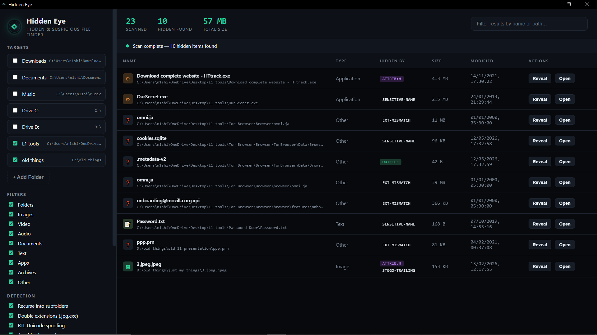
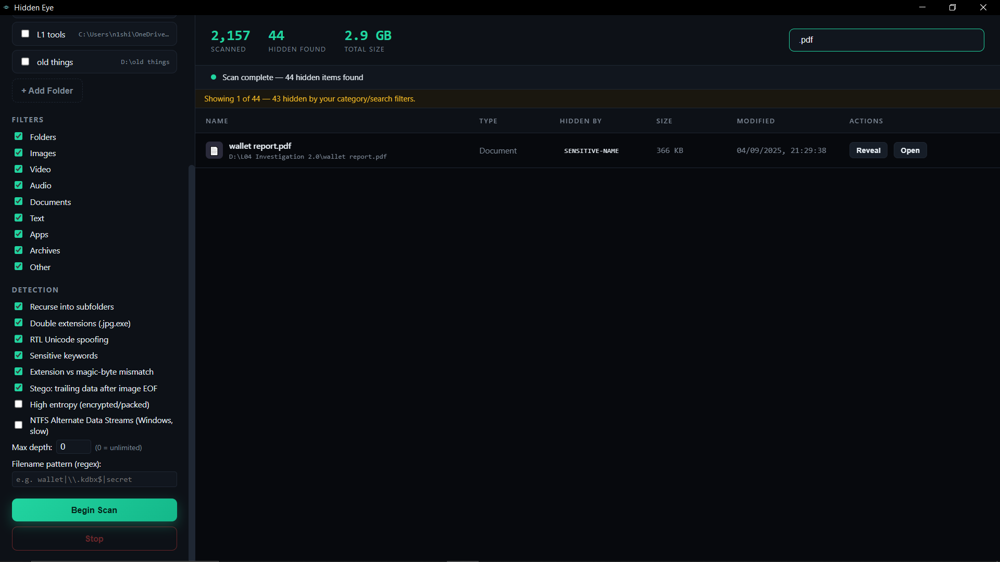

# 👁 HiddenEye

> **Uncover what’s hiding in plain sight.**

HiddenEye scans your chosen path and reveals hidden files, suspicious patterns, and data anomalies that standard file explorers ignore — all through an intuitive desktop interface.

---

## Features✨

| Detection | What It Does |
|-----------|--------------|
| Hidden Files | `attrib:H` (Win), `chflags:hidden` (mac) |
| Double-Extension Spoof | `photo.jpg.exe` style traps |
| RTL Override | Unicode bidirectional filename tricks |
| Magic-Byte Mismatch | File content ≠ extension (e.g. ZIP pretending to be JPG) |
| High Entropy | Encrypted / packed / obfuscated data |
| Steganography | Data appended after JPEG/PNG EOF |
| Sensitive Keywords | `password`, `wallet`, `id_rsa`, `.env`, tokens, etc. |
| NTFS ADS *(Win)* | Alternate Data Streams |
| Regex Search | Hunt custom filename patterns |
| Smart Recursion | Deep scan with system-folder protection |

---

## 📸 Screenshots

  

  

---

## Download & Run

| OS | File | Command |
|--|--|--|
| Windows | `HiddenEye-win32-x64.zip` | Run `HiddenEye.exe` |
| macOS | `HiddenEye-darwin-x64.zip` | Open `HiddenEye.app` |
| Linux | `HiddenEye-linux-x64.tar.gz` | `./HiddenEye` |

> ⚠️ Windows SmartScreen / macOS Gatekeeper may warn on first launch — this is normal for unsigned indie security tools.

---

## Safe Use

**For authorized analysis only.** HiddenEye is read-only — it never modifies, deletes, or exfiltrates files.

---

## 📦 Releases

Check the [Releases](../../releases) page for the latest builds and changelogs.

---

*Built for the cybersecurity community.*

